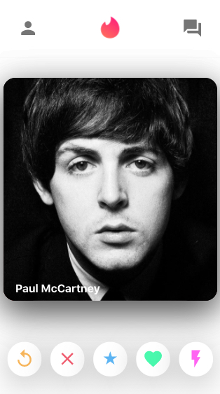
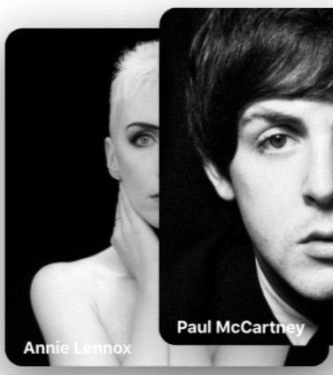
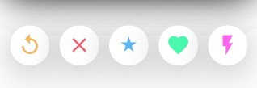
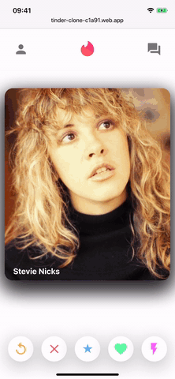

## About the project

This is an experimental project, to learn React JS.

Using [Create React App](https://github.com/facebook/create-react-app), I'll try to "clone" the original tinder app, with all the screens and functionalities.

To begin with, a database on Firebase will be used, because of the ease of use. Further, for learning purposes, I'll try different approaches for backend, like SQL and NOSQL databases (like MongoDB).

### Done: 
1. Created a database in Firebase and connected to the app, with the names and images to be shown on the cards;

2. A ***Header/NavBar*** with three icons;

3. A body with a stack of cards, with the functionality of swipe right or left;

#### Swipe Right:

#### Swipe Left:

4. A footer with five round buttons;

5. A page with all the chats and;

6. Another page for each chat, with some functionalities.

### To be done:
1. Create the other functionalities/screens of the app;

2. Put each and every one button to work properly;

2. Authentication for the users in Firebase;

3. Adjust the database to contain all the data for each user, including his name, picture, name of other users chosen(or not) by him and the chat content;

4. Think of another type of database, if necessary, to keep all this data;

5. Improve the responsivenes of the app;

### Demo:

### Obs:
The app can be seen [here](https://tinder-clone-c1a91.web.app)

